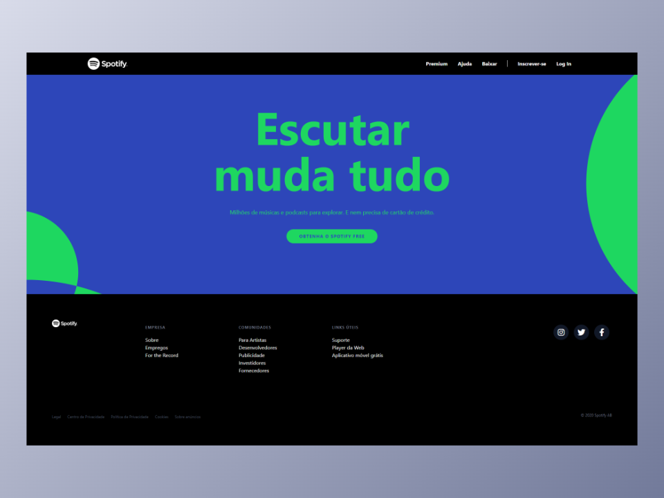

<h1 align="center">Clone da Home Page do Spotify</h1>

* [Descrição do Projeto](#descrição-do-projeto)
* [Tecnologias](#tecnologias)
* [Layout](#layout)

<h2>Descrição do Projeto</h2>

  O projeto foi desenvolvido com o objetivo de praticar conceitos do Tailwind.

<h2>Tecnologias utilizadas</h2>

* HTML
* Tailwind CSS

<h2>Layout</h2>

<h3 align="center">Web</h3>

  

<h3 align="center">Mobile</h3>

  

